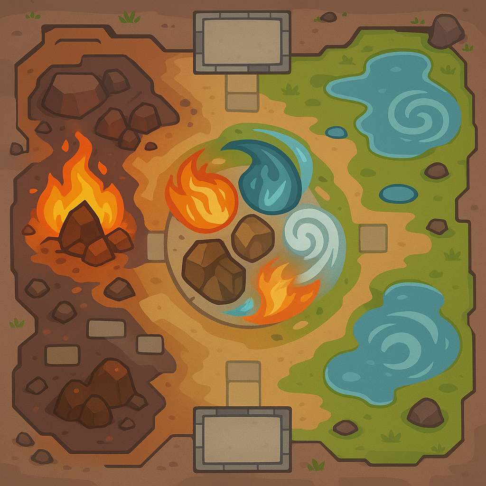

# AVATAR FPS
## Design Outline - AVATAR FPS

### 1. Overview

In Avatar FPS players engage in 4v4 team-based combat inspired by the bending arts from Avatar: The Last Airbender. Each team consists of four distinct bender types: Waterbender, Earthbender, Firebender, and Airbender. The game revolves around capturing and controlling 2 strategic zones across carefully designed arenas that incorporate all four elemental environments.

Each bending discipline offers unique abilities:
- **Waterbenders** focus on healing and crowd control
- **Earthbenders** provide defensive capabilities and barriers
- **Firebenders** excel at offensive damage output
- **Airbenders** utilize superior mobility and disruption tactics

Teams must coordinate their diverse abilities to outmaneuver opponents and secure objectives.

A central mechanic is the "Avatar State" system, where players can temporarily harness all four elements by capturing a special "Spirit Zone" in the middle of the map that appears periodically. The Avatar can use the ultimate abilities of all four elements once.

### 2. Purpose of the Game

**Goal**: Control strategic zones to accumulate points while utilizing unique bending abilities and team synergy. The first team to reach 100 points wins, or the highest-scoring team when the time limit expires.

**Target Audience**:
- **Age Group**: 16 and up
- **Interests**: Team-based competitive games, Avatar franchise fans, hero shooter enthusiasts, tactical FPS players

### 3. Design

#### A. Functionality

##### Core Features

**Character Selection**:
- Players may select any of the four bender types, but it is helpful to have diversity
- Each bender has a distinct playstyle with 2/3 unique abilities plus a passive ability and ultimate ability

**Zone Control Mechanics**:
- Two control zones exist on each map
- Teams earn 1 point per zone per 5 seconds of uncontested control
- First team to 100 points wins, or highest score after 15 minutes

**Avatar State System**:
- Special "Spirit Zone" appears in the center of the map every 3 minutes, and lasts 1 minute, and all players will be notified when it appears
- First player to channel (sit still in the zone, can shoot or use abilities) for 5 seconds enters the Avatar State
- Avatar State lasts 2 minutes, grants access to ultimate abilities of all elements
- Avatar State cooldown applies to the player after use (they cannot be the avatar the next time it appears)

**Environmental Interaction**:
- If a bender is in the environment of their elements, they will gain a small buff to their abilities, to incentivize choosing different characters

##### User Flow

**Match Start**:
- Select bender type
- Match begins with countdown and teams spawning at opposite ends of the map

**Core Gameplay Loop**:
- Capture and defend zones using bending abilities
- Each player has 100hp, when players die, they respawn in 5 seconds at their initial spawnpoint
- Extra Feature: Coordinate with teammates to create elemental combinations?
- Contest the Spirit Zone when it appears
- Adapt strategies based on map areas and enemy composition

**Progression**:
- Players earn experience and currency after matches
- Unlock cosmetic items, and titles
- Extra content: can add additional abilities so load-outs can be customized - additional abilities can be earned by playing

##### Mechanics

**Bending Abilities**:

*Waterbender*:
- Abilities: Healing Waters, Ice wall, Tidal Wave
- Basic attack: shoots icicles
- Ultimate: Geyser (heals allies, harms enemies)

*Earthbender*:
- Abilities: Stone Shield, Earth Wall, dust bomb
- Basic attack: close-range earth spike
- Ultimate: Earthquake (slows enemies, deals damage over time in large area)

*Firebender*:
- Abilities: Fire Dash, Fire bomb, Lightning Strike
- Basic attack: small fireball
- Ultimate: Meteor (big damage)

*Airbender*:
- Abilities: Wind Dash, Cyclone Shield, Updraft
- Basic attack: airball
- Ultimate: Tornado (no direct damage, but obscures vision, hearing, and sends enemies flying)

**Avatar State**:
- Temporarily grants one ultimate from each element
- Distinctive visual effect (glowing eyes and elemental aura)
- Increased movement speed

**Environmental Mechanics**:
- Water areas provide healing boost to Wa
